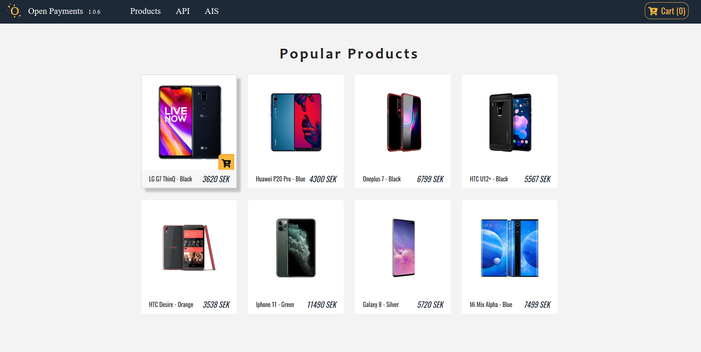
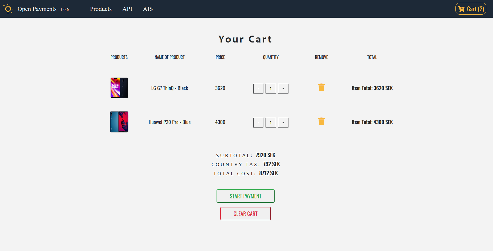
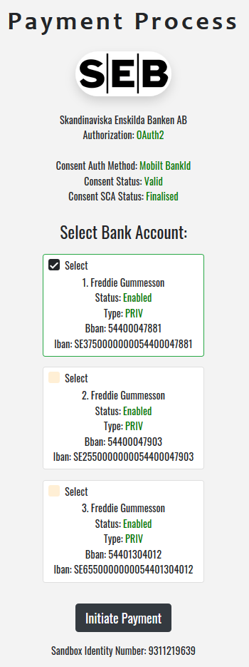
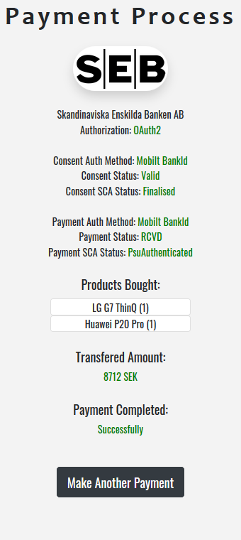
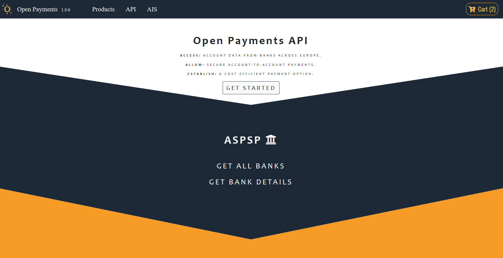
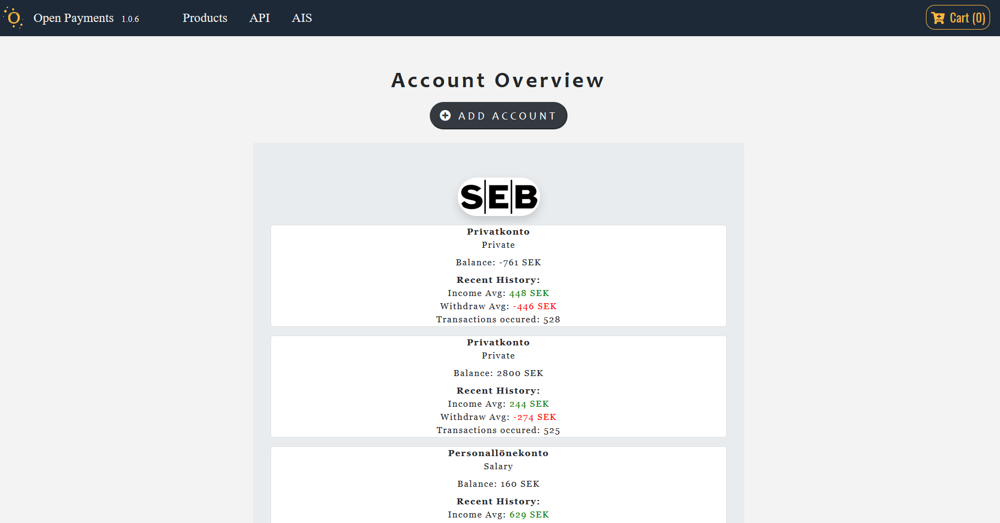
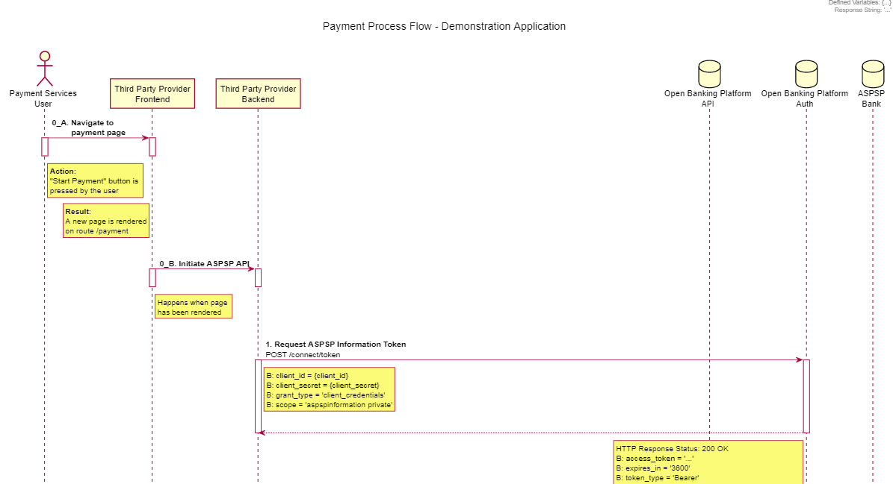

# OpenPaymentsDemo

- There were three main goals with this application. Firstly, to show customers/companies possible use cases of Open Payment's API. Secondly, to give insight in the API's account and payment procedures. Thirdly, to learn the best practices of user-first approach, scalablity and security. These goals were reached by displaying dynamic content to the user in the front-end, setting up secure and modular environments, and implementing user-friendly functionalities such as a light/dark mode and session-based processes.

## Getting started

0. Prerequisites:

   - **A terminal such as: Git Bash**

   - **A package manager such as: NPM**

1. Navigate into the backend folder:

   - **cd backend**

2. Run the command:

   - **npm install && npm run client-install**

3. Start the frontend (client) and backend (server) concurrently:

   - **npm run dev**

## Frontend - User Interface

### Landing page

### Landing page - Dark Mode

### Cart page

### Payment flow

 

### API page

### AIS page

## Preview of responsiveness

## Process flow diagram (.puml file)

## General remarks:

A complete route between client and server is:

- For instance: http://localhost:5000/connect/token. However, the part 'http://localhost:5000' is left out and handled by the package.json (proxy) from the frontend folder:
- "proxy": "http://localhost:5000"

##### Tutorial link to Open Payments API - How to get started.

https://www.youtube.com/watch?v=v2QK4ZvXELM
